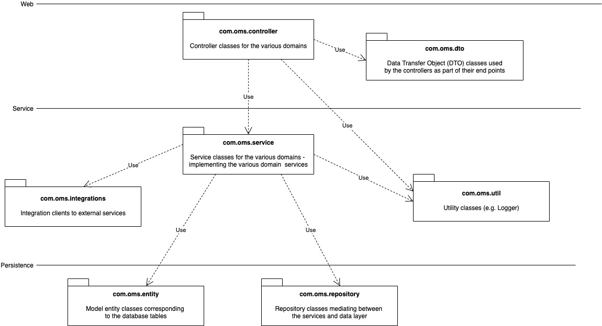

# Order Management System (OMS)
This is an example Spring application used by the tutorial of [vFunction](http://www.vfunction.com). 

## Prerequisites
* [Java 8](https://www.oracle.com/java/technologies/javase/javase-jdk8-downloads.html) or above
* [Tomcat 9](https://tomcat.apache.org/download-90.cgi) or above
* [Maven 3.6.3](https://maven.apache.org/download.cgi) or above
* [Postman](https://www.postman.com/) (optional)


## Compiling

After cloning the repository, switch to oms-webmvc folder and compile using maven:  

```
mvn clean install
```

The pom.xml under oms-webmvc, compiles several sub-modules. The app module is the "main part" compiled into the war file, while the other modules are compiled into jar files to be bundeled into the war file (compiled from app)

## Running (in Tomcat)

1. Copy the .war file under the target folder to the app folder to Tomcat (example:
```cp ~/oms-tutorial/oms-webmvc/app/target/oms-0.0.1-SNAPSHOT.war /Library/Tomcat/webapps```)

2. Restart Tomcat (run shutdown.sh and startup.sh in the bin directory of Tomcat)

3. To test that it works, go to the cloned repository. Switch to the script folder (e.g. ~/oms-webapp/script) and run  _./use_apis.sh_ . You shoud see printouts with OK at the end.

4. Optionally, you can import the Postman collection under the script folder (OMS.postman_collection.json), review and run the various requests.

## Using MySQL DB
The connection to MySQL DB is in _app/src/main/webapp/META_INF/context.xml_

## Design Overview

The OMS application is a Spring Web MVC application with 3 tiers as shown here:



Every controller class handles a different domain context as implied by their names, for example, OrderController covers everything related to managing orders while InventoryController handle all aspects of Inventory. Every controller performs its business functionality through a service class in com.oms.service package, which in turn uses the data access or persistence layer package for inetracting with the underlying RDBS (which is an in-memory H2 DB in our case)
